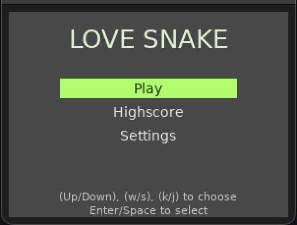
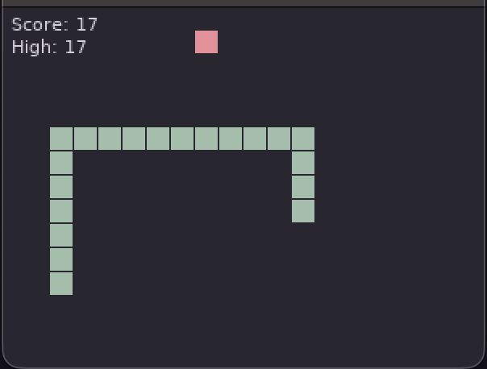
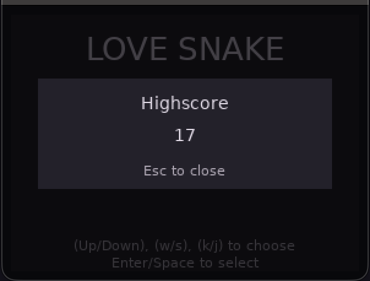

## Introduction

A Standard snake game with settings that I thought would make the game more fun.

## Table of Contents
1. [Installation](#installation)
2. [Game Rules](#rules)
3. [Controls](#controls)
4. [Game](#start-screen)
5. [Contibution](#contribution)

## Installtion

## Rules
- Eating food makes the snake grow.
- When food is eaten it moves to another random place.
- Snake wraps around the screen (optional).
- Game over when snake hits itself (or the wall).

## Controls 
1. Arrow keys
2. wasd
3. hjkl

These controls work everywhere in the game (start screen, settings, game)

## Start-screen
The game starts with a start screen for navigating to other screens.

## Game-screen
Starting with 3 segments, eat food to grow and to improve your highscore.

## Highscore screen
A minimal screen to show you your alltime highscore

## Settings

- wrap snake(on/off) - touching the edges doesn't kill the snake
- speed of game90-100) - it works in reverse, lower to speed here to make the game fast
- shape of game (sharp/rounded) - Shape of the menus, snake, food
- theme
    - default
    - rose-pine
    - catppuccin mocha
    - gruvbox dark
    - solarized dark
    - tokyo night
    - cyberpunk
    - one dark
    - nord
    - kangawa
- enable sound (eat food/ snake die) - put your computer's speakers to full volume because you would like to hear these sounds more.
[rules](#rules)
